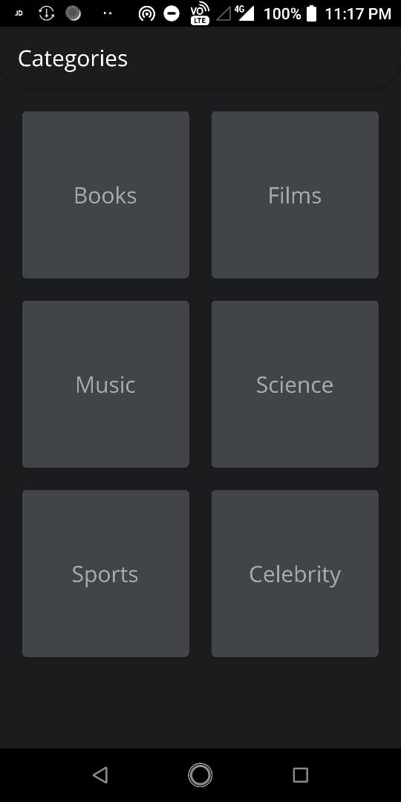
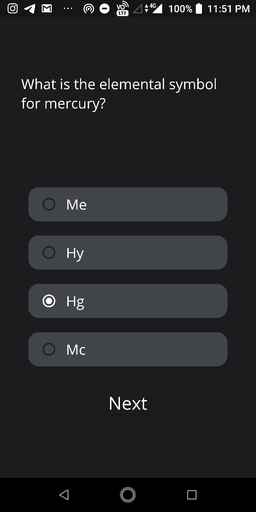

# Quizono_Tech
This application is specially developed for People who like to play challenging Quiz. The project provides an effective
challenge to the player.


## framework

[Flutter](https://flutter.dev/)


## Set Up:

### 1. Fork it 

### 2. Clone it :busts_in_silhouette:`

You need to clone (download) it to local machine using

```sh
$ git clone https://github.com/Your_username/Quizono_Tech.git
```

> This makes a local copy of the repository in your machine.

### 3. Ready Steady Go... :

Once you have completed these steps, you are ready to start contributing by checking Issues and creating pull requests.

## Screenshots

Category Page<br>
<br>
Question Page<br>

